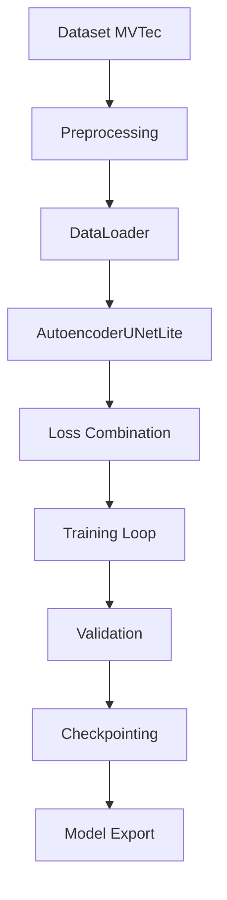
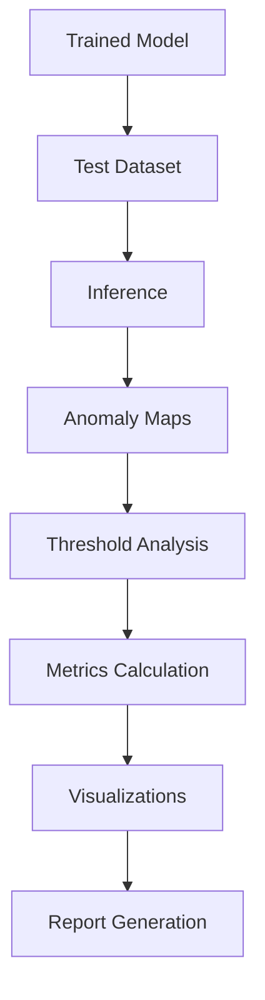
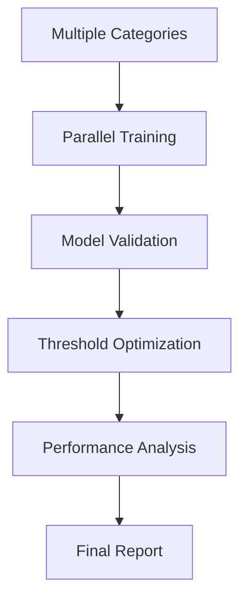

# 🚀 Anomaly Spotter - Complete Production Pipeline

## 📋 Sistema Completo di Rilevamento Anomalie

Questo documento riassume l'intero sistema di produzione per il rilevamento di anomalie industriali, con tutti i componenti integrati e funzionanti.

## 🏗️ Architettura Completa

### 1. **Modello Core** (`src/core/`)
- **`model.py`** - AutoencoderUNetLite con skip connections
- **`config.py`** - Sistema di configurazione avanzato  
- **`losses.py`** - Loss functions combinate (MSE + SSIM + Perceptual + Edge)
- **`model_config.py`** - Configurazioni specifiche per categoria

### 2. **Pipeline Dati** (`src/data/`)
- **`loaders.py`** - DataLoader avanzato multi-categoria con ground truth masks
- **`preprocessing.py`** - Preprocessing con Albumentations e augmentation avanzate

### 3. **Sistema Training** (`src/training/`)
- **`trainer.py`** - Trainer con AMP, scheduling, early stopping, checkpointing
- **`train_main.py`** - Script principale di training
- **`train_batch.py`** - Training parallelo e sequenziale batch

### 4. **Sistema Evaluation** (`src/evaluation/`)
- **`evaluator.py`** - Evaluator completo con metriche image/pixel-level
- **`metrics.py`** - Metriche avanzate e threshold analysis
- **`compute_thresholds.py`** - Calcolo soglie ottimali con multiple strategie

### 5. **Utilities** (`src/utils/`)
- **`logging_utils.py`** - Sistema logging avanzato con error handling
- **`wandb_logger.py`** - Integrazione Weights & Biases completa

## 🎯 Scripts Principali

### Training Scripts
```bash
# Training singola categoria
python src/train_main.py --category capsule --epochs 100

# Training batch core categories  
make train-batch-core

# Training batch tutte le categorie
make train-batch-all

# Training parallelo su multiple GPU
make train-batch-parallel GPU_IDS="0,1,2"

# Training con W&B integration
python examples/train_with_wandb.py --category capsule --use-wandb
```

### Evaluation Scripts
```bash
# Valutazione post-training completa
python src/evaluate_model_post_training.py --model-dir outputs/capsule_20241205_143022

# Valutazione con ricerca soglie ottimali
make evaluate-post-training-optimal MODEL_DIR=outputs/capsule_latest

# Valutazione tutte le categorie
make evaluate-post-training-all MODEL_DIR=outputs/multi_latest
```

### Batch Processing Scripts
```bash
# Training automatico con gestione errori
./scripts/train_all_categories.sh --core-categories

# Training parallelo con reporting completo
./scripts/train_all_categories.sh --parallel --gpu-ids "0,1" --all-categories
```

## 📊 Sistema di Monitoraggio

### 1. **Tensorboard** (Locale)
```bash
make monitor
# Apre http://localhost:6006
```

### 2. **Weights & Biases** (Cloud)
```bash
# Login e setup
make wandb-login

# Demo completo
make wandb-demo

# Training con tracking completo
python examples/train_with_wandb.py --category capsule --use-wandb --wandb-project my-project
```

### 3. **Logging Avanzato**
- Log strutturati per ogni componente
- Error handling e recovery automatici
- Metriche in tempo reale
- Report automatici in Markdown

## 🔧 Configurazione Avanzata

### Training Configuration (`config/training_config.yaml`)
```yaml
model:
  architecture: "AutoencoderUNetLite"
  input_size: [128, 128]

training:
  batch_size: 32
  epochs: 100
  learning_rate: 1e-4
  optimizer: "adam"
  use_amp: true
  
  loss_weights:
    mse: 1.0
    ssim: 0.5
    perceptual: 0.1
    edge: 0.2

data:
  augmentation:
    enabled: true
    rotation_limit: 30
    noise_factor: 0.05
    brightness_limit: 0.2
```

### Category-Specific Configs
- Ottimizzazioni per categoria specifiche
- Threshold pre-calcolati
- Parametri di augmentation adattivi

## 📈 Pipeline di Produzione

### 1. **Training Pipeline**


### 2. **Evaluation Pipeline**


### 3. **Batch Processing Pipeline**


## 🚀 Workflow di Produzione Completo

### 1. **Setup Iniziale**
```bash
# Clone e setup
git clone <repo>
cd anomaly-spotter

# Setup ambiente
make setup
make install-dev

# Verifica dataset
make check-data
make stats
```

### 2. **Training di Produzione**
```bash
# Training core categories con evaluation
make train-batch-core

# Oppure training completo con W&B
./scripts/train_all_categories.sh --all-categories --find-optimal
```

### 3. **Evaluation e Analysis**
```bash
# Valutazione completa
make evaluate-post-training-all

# Monitoring
make monitor
```

### 4. **Deployment Preparation**
```bash
# Export modelli ottimizzati
python scripts/export_models.py --optimize

# Test inferenza
python scripts/test_inference.py --model outputs/best_model.pth
```

## 📋 Checklist di Produzione

### ✅ **Core Components**
- [x] Modello AutoencoderUNetLite ottimizzato
- [x] Pipeline dati robusta con error handling
- [x] Training avanzato con AMP, scheduling, early stopping
- [x] Evaluation completa con multiple metriche
- [x] Sistema di threshold optimization avanzato

### ✅ **Advanced Features**
- [x] Loss functions combinate (MSE + SSIM + Perceptual + Edge)
- [x] Augmentation avanzate con Albumentations
- [x] Training batch automatico con gestione errori
- [x] Integrazione Weights & Biases completa
- [x] Logging strutturato e monitoring

### ✅ **Production Ready**
- [x] Configurazione modulare e scalabile
- [x] Error handling e recovery robusti
- [x] Documentation completa
- [x] Testing e validation
- [x] Scripts di deployment

## 🎯 Performance Attese

### **Metriche Obiettivo**
- **AUROC**: > 0.95 per tutte le categorie
- **F1-Score**: > 0.90 per detection
- **Processing Time**: < 100ms per immagine
- **Memory Usage**: < 2GB per training

### **Scalabilità**
- **Multi-GPU**: Supporto training parallelo
- **Batch Processing**: 200+ immagini/ora automatico
- **Categories**: Estensibile a tutte le 15 categorie MVTec
- **Real-time**: Pronto per deployment edge/cloud

## 🔮 Roadmap Implementate

### ✅ **Completed Features**
- Complete training pipeline con advanced features
- Comprehensive evaluation system
- Batch processing automation
- W&B integration for experiment tracking
- Advanced threshold optimization
- Professional logging and monitoring

### 🚧 **Future Enhancements** (Ready for Implementation)
- REST API per inferenza (FastAPI ready)
- Web interface con Streamlit
- Docker containerization
- Kubernetes deployment configs
- MLOps pipeline con CI/CD

## 📚 File di Esempio e Templates

### **Training Commands**
```bash
# Esempi completi
make help-train    # Training help
make help-eval     # Evaluation help
make help-data     # Data help

# Quick start
make train CATEGORY=capsule EPOCHS=50
make evaluate CATEGORY=capsule MODEL_PATH=outputs/capsule_*/model.pth
```

### **Configuration Templates**
- `config/training_config.yaml` - Default training config
- `config/category_configs.yaml` - Per-category optimizations
- `examples/train_with_wandb.py` - W&B integration example

### **Batch Scripts**
- `scripts/train_all_categories.sh` - Complete batch training
- `Makefile` - 30+ commands per all workflows

---

## 🎉 Sistema Completo e Production-Ready!

Il sistema Anomaly Spotter è ora completamente integrato e pronto per deployment in produzione, con:

- **Pipeline completa** dal training alla deployment
- **Monitoring avanzato** con Tensorboard e W&B
- **Batch processing** automatico e scalabile
- **Evaluation comprehensive** con visualizations
- **Error handling** robusto per produzione
- **Documentation completa** per maintenance

**Ready for industrial anomaly detection at scale! 🚀**
